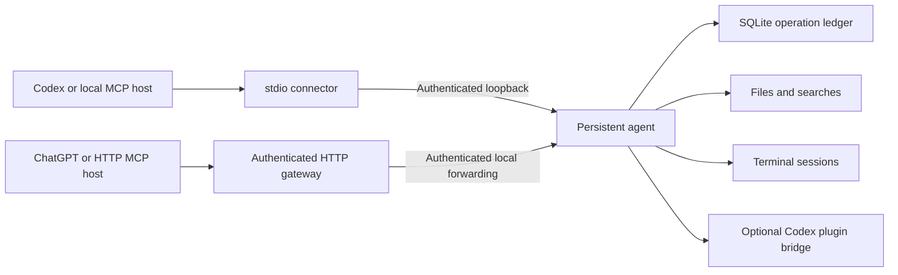

# One runtime, multiple platforms

Anywhere Computer uses one Python package for Linux, Windows and macOS. Models,
tool registry, operation ledger, file/search engine, local transport and MCP
connection are shared. The existing MCP entrances use the standard library.
The optional direct-MCP client under development uses the official MCP SDK;
it is not yet registered as a public tool. Basic file and terminal operations
do not depend on Codex or model generation.

The diagram shows a unified installation. Legacy configurations may still use a
separate HTTP-owned engine; `engine-unify` performs the offline state migration.
Credential and endpoint locations stay separate from the selected engine data.

The connector is disposable. Its disconnection does not stop agent-owned terminal
sessions. A dead agent can start again on the next connection or tool call. A
live but unresponsive process is reported as unhealthy, never killed blindly.
Compatible clients reuse the selected engine instead of replacing it with their
bundled build. Explicit updates require idle resources and persist runtime selection.
See [updating](UPDATING.md) for published behavior versus local development work.

An operation ID is claimed before execution. Identical retries reuse its result;
different arguments are rejected. After restart, unfinished operations become
`unknown`. This is not an exactly-once guarantee for arbitrary external effects.
Lost responses are never automatically replayed as writes.

## Portability

| Concern | Shared implementation | Small platform difference |
|---|---|---|
| Transport | Authenticated loopback TCP and standard MCP stdio | None |
| Credentials | keyring | Keychain / Windows Credential Manager / Secret Service or KWallet |
| State | Standard-library path selection and SQLite | Native per-user path |
| Files | pathlib, hashes, locks, atomic replacement | Exclusive create requires hard-link support |
| Terminals | asyncio session manager | Shell flags and process-tree termination |
| Validation | Same pytest suite | Three OS runners |

Headless Linux needs a usable OS credential service for detached agent mode.
Plaintext credential storage is not a fallback. Missing credentials are a setup
problem, distinct from network reachability.

## Current limits

Authenticated TLS and HTTP MCP adapters, OAuth grant/rotation endpoints and an
OS-keyring client renewal manager are implemented. macOS checks include public
HTTPS roundtrips, credential renewal, shared-engine migration and reconnection
after actual native-service upgrades. See the dated [update receipts](UPDATE-VERIFICATION-2026-09-12.md).
An embedded browser password/consent route is implemented with native-keyring
owner verification. An optional cloudflared child adapter can use an owner-provisioned
constant tunnel with native-keyring/OS-pipe credential handoff and bounded restarts;
it does not provision the public route. Complete first-run onboarding, graphical
desktop operations and standalone graphical installers remain unfinished.
The direct-MCP prototype has exercised an isolated browser through Playwright MCP,
but existing logged-in browser sessions and public browser tools remain unfinished.
Explicit per-user service
registration adapters exist for all three OSes; actual login/reboot remote recovery
is not yet certified.
The local agent's remote-readiness flag is not a public HTTPS health check.
Its local endpoint is not a public MCP HTTP endpoint; the HTTP gateway authenticates
that separate entrance. Office support currently
reads bounded Word, Excel and PowerPoint content, supports Excel A1 ranges, and
generates plain-text DOCX and typed multi-sheet XLSX. Formatting-preserving edits,
PDF support and rendering remain planned.

Terminals use pipes, not a PTY. Sessions survive connector disconnections but not
agent crashes. Operation records remain available after a restart.

Text reads/writes are limited to 16 MiB. Search supports bounded literal/isolated-process regex matching and limited OOXML
content. File moves use exclusive native rename for files, directories and symlinks
on the same filesystem. Hashes/locks protect cooperating
writers; a last-moment external edit can still race replacement. Backups preserve
prior content, and hash-checked restore is implemented. Retention controls remain planned. Operation results
may include private content and are stored locally; diagnostic history excludes
arguments and results.
