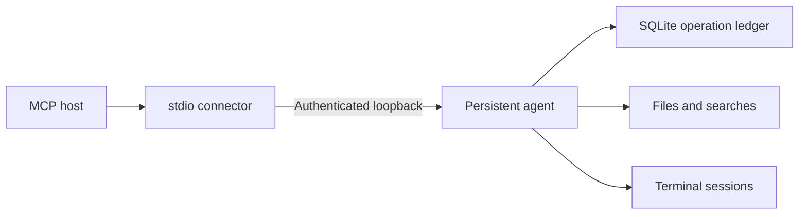

# One runtime, multiple platforms

Anywhere Computer uses one Python package for Linux, Windows and macOS. Models,
tool registry, operation ledger, file/search engine, local transport and MCP
connection are shared. The maintained MCP SDK 1.x adapter is pinned below 2.

The connector is disposable. Its disconnection does not stop agent-owned terminal
sessions. A dead agent can start again on the next connection or tool call. A
live but unresponsive process is reported as unhealthy, never killed blindly.

An operation ID is claimed before execution. Identical retries reuse its result;
different arguments are rejected. After restart, unfinished operations become
`unknown`. This is not an exactly-once guarantee for arbitrary external effects.
Lost responses are never automatically replayed as writes.

## Portability

| Concern | Shared implementation | Small platform difference |
|---|---|---|
| Transport | Authenticated loopback TCP and standard MCP stdio | None |
| Credentials | keyring | Keychain / Windows Credential Manager / Secret Service or KWallet |
| State | platformdirs and SQLite | Native per-user path |
| Files | pathlib, hashes, locks, atomic replacement | Exclusive create requires hard-link support |
| Terminals | asyncio session manager | Shell flags and process-tree termination |
| Validation | Same pytest suite | Three OS runners |

Headless Linux needs a usable OS credential service for detached agent mode.
Plaintext credential storage is not a fallback. Missing credentials are a setup
problem, distinct from network reachability.

## Current limits

Remote OAuth routing, device pairing, Office handlers, graphical UI, screen and
browser operations, service installation and standalone installers are planned.
Status advertises these capabilities as unavailable. The local endpoint is not
a public MCP HTTP endpoint.

Terminals use pipes, not a PTY. Sessions survive connector disconnections but not
agent crashes. Operation records remain available after a restart.

Text reads/writes are limited to 16 MiB. Search is literal and bounded. File moves
support regular files on the same filesystem. Hashes/locks protect cooperating
writers; a last-moment external edit can still race replacement. Backups preserve
prior content. Restore and retention controls remain planned. Operation results
may include private content and are stored locally; diagnostic history excludes
arguments and results.
