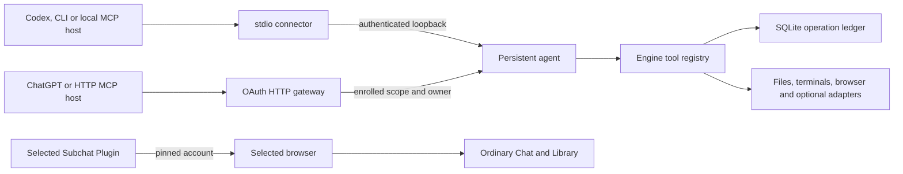

# Runtime and trust boundaries

Anywhere Computer uses one Python package on macOS, Windows and Linux. The
stdio connector and the authenticated HTTP gateway are entrances to an Engine;
they do not establish that a particular device or tool is ready. A separately
selected Subchat controller connects to an ordinary ChatGPT account.

```mermaid
flowchart LR
  Local[Codex, CLI or local MCP host] --> Connector[stdio connector]
  Chat[ChatGPT or HTTP MCP host] --> Gateway[OAuth HTTP gateway]
  Connector -->|authenticated loopback| Agent[Persistent agent]
  Gateway -->|enrolled scope and owner| Agent
  Agent --> Engine[Engine tool registry]
  Engine --> Ledger[SQLite operation ledger]
  Engine --> Resources[Files, terminals, browser and optional adapters]
  Subchat[Selected Subchat Plugin] -->|pinned account| Browser[Selected browser]
  Browser --> OrdinaryChat[Ordinary Chat and Library]
```

`connection.serve` owns the local agent process lock and its Engine.
`mcp_server.MCPSession` exposes the registered tool schemas over stdio;
`connection.exchange` carries requests to the agent with a local credential
and checks the returned operation ID. `http_service.http_service` checks saved
enrollment before opening the HTTP gateway. It can forward to a selected shared
agent or keep a separate Engine for an older configuration. The offline
`engine-unify` migration is described in [updating](UPDATING.md). A source
version, installed Plugin version and running Engine version can differ;
compare `computer_status` runtime and instance IDs from each entrance.

After `engine-unify`, the control directory keeps credentials and endpoint
metadata while `engine_directory()` selects the Engine ledger. The agent and
delegated file workers resolve that same selection before reading runtime
settings. This is why a child file grant observes the active read and write
line limits even when the old control ledger remains on disk.

`Engine` registers typed tool contracts once and owns the operation ledger,
file locks, terminal sessions, searches and optional browser, document, GUI and
Plugin adapters. The transport supplies owner identity and allowed tools;
tool arguments cannot select another owner. The HTTP gateway applies the
enrolled OAuth grant before forwarding. Local filesystem access is still the
owner's access, not a sandbox for mutually untrusted users. See
[authorization](AUTHORIZATION.md), [HTTP setup](HTTP-SERVER.md) and
[remote transport](REMOTE-TRANSPORT.md) for these boundaries.

## Why a lost response is recoverable

The Engine claims an operation ID before dispatch, records its result in SQLite
and keeps dispatched work in an Engine-owned task when an observer disconnects.
An identical request ID can retrieve its recorded outcome; a different request
under that ID is rejected. A restart can leave an unfinished external effect
`unknown`: neither a ledger row nor an HTTP success alone proves what happened
at the destination. Callers inspect the original ID and destination state
before deciding whether another operation is safe. The connector can reconnect
without ending an agent-owned terminal, but agent restart does not restore
in-memory terminal or Plugin sessions. See [operation history](OPERATION-HISTORY.md)
and [Plugin sessions](PLUGIN-SESSIONS.md).

The ordinary-Chat Subchat Plugin has its own account-scoped ledger and browser
preparation. A send is reserved before its provider request; `prepared`,
`sending`, `submitted` and `completed` describe different evidence. Its
Library uploader first pins local bytes and account, then uploads to Library;
only a separate send using the returned attachment reference places that file
in a Chat. A local path, a peer mailbox receipt or a queued child does not
insert content into another model turn. See [Subchat](SUBCHAT-PROBE.md) and
[peer messaging](PEER-MESSAGING.md).

The HTTPS `subchat_list` scope exposes saved operation summaries. Its optional
prompt preview reads stored message text, so the gateway checks the additional
`subchat_prompt_preview` OAuth scope on each request. A previously approved
list-only grant cannot gain prompt access merely by upgrading the server.

## Platform differences and dependencies

| Concern | Shared contract | Platform or optional component |
| --- | --- | --- |
| Files and history | Hash-checked operations, backups and SQLite receipts | OS file locks and credential store |
| Terminals | Pipe sessions, incremental output and explicit stop | POSIX PTY or Windows ConPTY and Job ownership |
| Browser | Owned isolated tabs and observed click/fill targets | Installed Chrome or Edge; optional Playwright |
| GUI | Observed window and element identity | macOS Accessibility helper or selected external MCP adapter |
| Documents | Bounded OOXML text read and simple write/edit | macOS preview needs LibreOffice, Poppler and sandbox support |
| Remote | Enrolled device and tool identity | SSH or configured TLS/HTTPS route; no automatic public route |

`pyproject.toml` keeps browser, MCP and relay support in explicit extras. The
standard-library stdio connector does not require the official MCP SDK;
interoperability tests do. Optional adapters report missing prerequisites
instead of silently changing execution paths. See [terminal](TERMINAL.md),
[GUI](GUI-MCP.md), [documents](DOCUMENTS.md), and [portable builds](PORTABLE.md)
for exact capability and platform limits.

The [Quality workflow](../.github/workflows/quality.yml) runs lint, type checks,
the test suite and platform builds. On a successful `main` version bump it
attests the portable archives and publishes a release after checking their
shared clean build receipt and uploaded hashes. Those checks establish source
and artifact evidence. Live ChatGPT, OS permissions, physical hosts and a
fresh installed client still require separate acceptance observations.
An existing version tag bound to another main commit stops publication, so a
new main revision needs a new version before it can become a release.
An interrupted draft can resume only for the same commit when its tag has not
yet been created.
