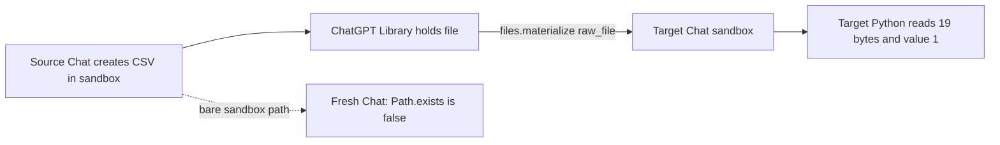

# Explicit HTTP-only ordinary Chat generation

## Personal-use permission and scope

On 2026-09-23, the account owner confirmed receiving permission for HTTP requests
to their personal ordinary Chat on the same basis as requests made through a
browser UI. Selling that access to other users is prohibited. Before enabling a
distribution or deployment, verify the answer's exact scope and conditions;
its original wording, sender, account scope, authentication method, and any other
operational conditions have not yet been reviewed in this repository. The existing
successful HTTP trials establish technical acceptance for observed sessions, while
independent login and renewal remain separate implementation requirements.

`anywhere-subchat --http-only` remains read-only by default. Generation is an
opt-in process mode. Start it with `--http-session-stdin --http-generation-stdin`
and supply two bounded JSON lines through a trusted anonymous stdin pipe before
CLI commands or MCP framing. The first line is the existing observed read session.
The second line contains a complete, successful Chrome generation header set and
request templates held only in memory. Treat every value as sensitive, since the
full captured body may contain fields whose sensitivity is unknown. Do not place
either line in argv, logs, files, MCP tool calls, or shell history. In this
explicit-stdin mode, the controller never opens Chrome, discovers credentials,
renews a session, or produces Sentinel proof or Turnstile values.
The HTTP-only path uses one process-owned HTTPX client for catalog and history
reads, preparation, branch checks, and generation. The separate browser-assisted
path still uses Playwright. The explicit-stdin HTTP-only mode does not launch
Chrome; the optional Chrome-login startup below opens it headlessly.

An alternative startup mode, `--http-only --chrome-login-profile PATH`, opens an
already logged-in dedicated Chrome profile headlessly. It reads Chrome cookies
and User-Agent in memory, then HTTPX performs `GET /api/auth/session` and validates
the returned bearer token/account with a separate HTTPX model-catalog GET. It
does not require a pasted session line. Generation still requires a separate
observed request handoff; the Chrome login GET by itself does not provide the
Sentinel/proof values or generation body. This mode has no automatic renewal.
If the saved Chrome login expires, the owner must log in again in that dedicated
profile. Do not point the tool at a normal Chrome profile that is in use.
For multiple accounts, use a separate dedicated Chrome profile for each intended
Chat account. Start read-only and inspect `capabilities` (or
`subchat_capabilities` in its MCP session) for the authenticated email and
account ID returned by the HTTP auth GET. To enable generation from a Chrome
profile, pass that exact ID as `--expected-account-id`. Startup rejects a
different active account before accepting a generation handoff or command.
The email is displayed only by this explicit status query and is not saved in
the operation ledger. Individual submissions save the authenticated account ID
for later recovery and account-switch checks.

In a 2026-09-23 live read trial, headless Chrome's Cookie and actual User-Agent,
with `sec-fetch-site: same-origin`, `sec-fetch-mode: cors`, and
`sec-fetch-dest: empty`, let HTTPX authenticate with status 200. HTTPX then got
the model catalog with status 200 using the returned bearer/account plus Cookie
and User-Agent. Cookie alone on the auth GET and bearer/account alone on the
catalog GET each returned 403. The trial checked statuses and response shape;
no credential values were printed or saved. A headless Chat page displayed a
waiting screen and did not load the composer, so browser-UI capture of a fresh
generation handoff did not succeed in headless mode. This trial establishes
HTTPX login and catalog, not a generated answer from that new GET token.

Later on 2026-09-23, a live minimized-Chrome control supplied the request
templates and protection values in process memory. Separately, HTTPX performed
the Chrome-cookie authentication GET and catalog GET, both with status 200.
The generation handoff's authorization, account and Cookie were replaced with
those returned or read through this login path before HTTPX sent a new Chat.
Durable diagnostics recorded status 200 for Sentinel preparation, conversation
preparation and the generation POST. The operation
`c848d5667f604365979c568edaea5e66` reached `completed`; HTTPX history
recovery found the saved final answer containing its test marker. The temporary
ledger is under the owner's private Anywhere Computer application support
directory. No token, Cookie, proof value, request body or answer text was
printed or committed. This proves live new-Chat generation using the token
obtained by HTTPX GET for this session and request shape. Automatic acquisition
of generation protection values and session renewal remain unimplemented. The
first trial did not include a queued follow-up.

A subsequent 2026-09-23 trial completed the same flow for both a new Chat and a
queued follow-up. The new operation `b51d51b1d32d4450886c84faa3d56a15`
and follow-up `cfff8dd647ff43b79703650bafc73102` both reached `completed`.
HTTPX history contained each requested test marker, and the follow-up remained
in the same conversation. Both operations recorded HTTP 200 for Sentinel,
conversation preparation and generation; the follow-up's branch GET was also
200. A fresh, never-logged-in temporary Chrome profile failed to establish a
session with `SubchatAccessError`, before any generation could be dispatched.
These are one-session live results, not an expiry or automated-handoff proof.

The same flow then tested every distinct available GPT-5.5 and GPT-5.6 effort
in the 2026-09-23 HTTP catalog, plus GPT-6 Pro: 11 new Chats in one session.
All 11 recorded HTTP 200 for Sentinel preparation, conversation preparation,
and generation; all reached `completed`, the final answer contained the
operation's unique test marker, and the history-reported model slug and
`thinking_effort` matched the selected values. Tested choices were GPT-5.5
Instant, Thinking standard/extended/max and Pro; GPT-5.6 Sol Instant,
standard/extended/max and Pro; and GPT-6 Pro. The exact catalog version and
preset IDs were used for every send, with no fallback from an unavailable
selection. Numeric `juice` values were not present in the observed catalog or
history settings; this trial does not map them to Chat effort levels.

Read-only HTTP history inspection found `reasoning_recap` messages for the
tested thinking and Pro replies, alongside final answer messages. This is a
provider-visible recap record, not raw chain of thought. The existing Subchat
answer projection returns the final text and provider model/effort settings;
it does not export recap content. Instant replies in this trial had no recap.

## Sandbox file handoff experiment

For the parent/Subchat file-exchange design, use ChatGPT Library as the
server-side handoff. The sending Chat should provide the source conversation
URL and the exact file name to the receiving Chat. The receiving Chat should
locate the file in Library, materialize it into its own sandbox, and read it
with a tool. Accept the handoff only after checking the receiving Chat's tool
result against the expected bytes or a digest. Keep the source URL and file
name in the request and the receiving operation's durable record; do not store
the file body in the local Subchat ledger. This is an intended protocol based
on the single live trial below, not a general guarantee that every Chat can
find every Library file. The Plugin has no automatic Library handoff tool yet.

On 2026-09-23, HTTPX recovered a completed synthetic CSV response and fetched
its `sandbox:/mnt/data/...` file through the source conversation's
`/interpreter/download` metadata route and the returned same-origin
`/backend-api/estuary/content` route. Both GETs returned 200. The 19-byte
response matched the generated CSV and its expected SHA-256. The metadata
contained `metadata.file_id`, but `file_size_bytes` was null in a later read;
the downloader now enforces its byte cap and reports the actual streamed length
in that case. It keeps the bytes in memory and does not write a local file.

A separate Chat was asked to open the source `sandbox:/mnt/data/...` path and
read the CSV without downloading it. Its first completed reply claimed that
the file was absent, but that reply had no file-open tool result and does not
establish absence. After a second prompt supplied the source conversation URL
and asked the Chat to try its available methods, its completed answer reported
finding the CSV in Library and using `files.materialize` with `raw_file` to
copy it into this conversation's `/mnt/data`. HTTP history contains that tool
call and a subsequent Python execution that read the same path, reported
19 bytes and the correct `probe` value `1`. The target user messages had no
attachment metadata. This establishes a successful Chat-driven, server-side
Library materialization for this synthetic file without local-terminal transfer.
It does not establish direct cross-Chat sandbox access or an externally callable
HTTP endpoint for `files.materialize`.
In a third, new Chat on the same account, the owner explicitly prohibited
Library, materialization, attachment and file creation, and asked Python to
evaluate `Path('/mnt/data/ac_subchat_file_probe_20260923.csv').exists()`.
The actual Python result was `False` and the completed answer was `なし`.
This control rules out a simply shared `/mnt/data` path for these Chats.

The existence of a source `file_id` does not yet prove that the target Chat can
attach or copy it through an explicit HTTP request.
The browser-assisted resource send experiment stopped at
`SubchatPreparationFailed` before a request with that file ID was sent; it is
not evidence for or against provider acceptance of the file reference.

Parent/Subchat file exchange through the Plugin remains an open integration
task. An explicit HTTP file-transfer feature must verify the target's saved
file state and actual bytes. An answer containing the expected CSV value alone
would be insufficient; this trial also observed the target's Python read.

The generation handoff has four fields:

| Field | Required content |
| --- | --- |
| `headers` | All 28 recognized names from the observed successful generation request, with their actual values. Authorization and account must equal the read-session line. Origin and referer must be `chatgpt.com`. |
| `sentinel_p` | The observed `p` value for `POST /backend-api/sentinel/chat-requirements/prepare`. |
| `prepare_template` | The full body observed on a successful conversation preparation, including `client_prepare_state: "sent"`, `partial_query`, timezone, and other observed fields. |
| `generation_template` | The JSON body template observed on a successful ordinary Chat generation. Message fields outside its input ID, text parts, and creation time are preserved. |

For each submission, the backend validates the exact HTTP catalog selection and
labels, saves a new outgoing input ID and account in the existing `SubchatSubmissions`
ledger, then sends Sentinel and conversation preparation once. The preparation
body retains observed fields and updates only input, model, effort,
conversation, and parent. It changes only
`accept` to `application/json` for preparation. The original successful generation
headers, including the handed-off Sentinel values and `accept: text/event-stream`,
are used for generation. A new Sentinel response token is observed but is not
substituted into the copied proof/Turnstile header set: that combination has not
been verified. No provider value is fabricated.

A queued follow-up rechecks its saved final answer against HTTP history and checks
the singular conversation endpoint's `current_node` against that exact assistant
final immediately before generation. New Chat omits conversation and parent IDs.
After preparation and branch checks, the durable dispatch claim commits before one
generation POST. SSE supplies only a conversation candidate. The existing flat
history projector must verify the saved input, unique final answer, and terminal
markers before the ledger reports `completed`.

Preparation failures leave the operation `sending` because remote effects are not
known. The same operation is never prepared or posted automatically again. A lost
generation response likewise remains uncertain; use `recover` with the original
operation ID. A new Chat without a conversation candidate may require manual
reconciliation. The expiry time and independent login have not been established.
Localhost tests verify the transport and ledger contract; they are not provider
acceptance tests.

On 2026-09-23, a separate live Subchat CLI acceptance run used a successful Chrome
generation as its explicit in-memory handoff, closed Chrome, selected the model
and effort from the live HTTP catalog, then sent a new Chat and a queued follow-up.
Each dispatched once and reached `completed` through independent HTTP history;
the follow-up remained in the same conversation. The trial used a temporary
ledger and did not save or print header or body values. This confirms acceptance
for that observed session and request shape; handoff expiry remains unmeasured.

A separate 2026-09-23 lifetime trial waited 1,800 seconds after Chrome closed,
then used the previously observed handoff for HTTPX Sentinel preparation,
conversation preparation, generation SSE, and final history recovery. The new
Chat and follow-up reached `completed` with saved final answers. This demonstrates
that those exact observed values worked for at least 1,800 seconds on that session;
their expiry time is still unmeasured. That trial preceded this change to a single
HTTPX client, so it does not establish live provider acceptance of the unified
transport.

An additional 2026-09-23 browser-path control used the dedicated logged-in
profile to submit one new GPT-5.6 Sol Chat. The saved operation
`f082d180e84547cdbd68decc457df9ad` reached `completed`; a separate
HTTP history read through the browser adapter contained the requested test marker.
The monitored target
Sentinel preparation, conversation preparation, and generation POSTs each returned
200. Only request field names and status codes were observed. Sentinel preparation
carried a body field `p`. Generation carried `messages`, `model`,
`thinking_effort`, timezone and client-context fields; the first message carried
author, content, ID, metadata, status, timing, channel, recipient and weight fields.
Generation header names included `authorization`, `cookie`, `chatgpt-account-id`,
three Sentinel-related headers, origin/referer, client-hint and frontend fields.
No header values, request bodies, or answer text were saved in this record. This
control establishes the browser's HTTP request shape and final result, not
standalone authentication or generation with the unified HTTPX transport.

The frontend's current JavaScript includes a cookie-backed `/api/auth/session`
refresh flow that validates the returned access-token account and user before
updating browser auth state. One HTTPX request using the observed session Cookie,
`oai-did`, and target-path/route headers received 403 with no `Set-Cookie` and no
`accessToken` in the response. A successful browser refresh request was not
observed, so the HTTPX rejection cause and whether the endpoint renews a standalone
HTTP session remain unresolved. Credential refresh is not implemented.
