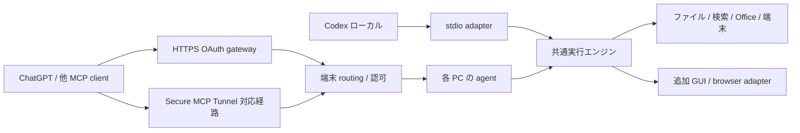

# Anywhere Computer: Remote Desktop Commander 代替の機能・仕様調査

調査日: 2026-09-08（日本時間）。これは実装前の調査・要件資料。プラグイン本体は未実装で、公開・インストール・端末登録は行っていない。

**判断:** ローカル実行エンジン、リモート接続、ChatGPT/Codex 用パッケージを分離すれば、既存機能を引き継ぎながら拡張できる。自前で運営する経路には Desktop Commander の月間呼び出し枠を設けずに済む。ただし AI 製品の利用枠、通信・計算資源、ホスティング費用は別である。

## 1. 調査範囲と証拠

対象リポジトリは調査開始時に `.git` のみで、追跡ファイル・既存コード・テストはなかった。既存の関数・型・呼び出し元への変更はない。

|対象|今回確認したもの|証明していないもの|
|---|---|---|
|Remote サービス|公式公開資料、本セッションに提供された 30 ツールの宣言と説明|認証済みサーバーへの新規 `tools/list`、全ツールの実行結果、非公開サーバー実装|
|ローカル実行エンジン|公式ソースの manifest、ツール登録・dispatch・Zod schema、主要ファイル handler、検索・端末・UI・remote-device の構造|全コード行の監査、全 OS の E2E、npm latest と Git HEAD の一致|
|OpenAI|現行公式 Plugins 文書、Codex MCP 文書、Secure MCP Tunnel 文書|このアカウントの developer mode / Tunnel 権限、公開審査通過|
|料金変更|ユーザーが提示した通知|アカウントへの適用済み状態、追加課金条件や繰越ルール|

ソース固定点:

- [DesktopCommanderMCP](https://github.com/wonderwhy-er/DesktopCommanderMCP/tree/56deabc3fe3c586f91728c56da5715712ff34eb6): commit `56deabc3fe3c586f91728c56da5715712ff34eb6`、package.json は `0.2.48`。
- [Remote 公開資料](https://github.com/desktop-commander/remote-desktop-commander/tree/b480501dcca59f802ebaf97f2f57b45252d0b720): commit `b480501dcca59f802ebaf97f2f57b45252d0b720`。
- `2026-09-08-tool-catalog.json`: このセッションに提供された 30 ツールの TypeScript 呼び出し宣言。サーバーの完全な JSON Schema や outputSchema の保存物ではない。

通知の内容は Free が月 10,000 tool calls、Pro が月 $20 で calls と接続端末数が unlimited、優先サポート。9 月 14 日に一部から開始し、9 月末までに全体へ順次適用とのこと。通知は年を明記していない。今回の調査日と合わせた 2026 年の予定という解釈で扱う。Free の端末数上限、失敗・UI 呼び出しの課金対象、カウント更新日時は通知からは不明。

単体 Desktop Commander App は、公式サイトの現行表示では **月 $20 からの Credits Plan**。新規アカウントに無料の開始クレジットがあり、AI モデルの利用量に応じて bundle を選ぶ。これは通知された Remote Pro の tool-call 枠とは別の料金説明で、相互に含まれるとは確認できない。[App 公式料金](https://desktopcommander.app/pricing/)

## 2. 全 30 ツールの機能台帳

共通条件: `list_devices` / `who_am_i` を除く型が明示された Remote 操作には任意の `deviceId` がある。省略時は最初のオンライン端末を選ぶと宣言されている。`edit_block` はセッション側では自由なオブジェクト型であり、詳細はローカル Zod schema で補った。リモートの詳細 schema と同一とは断定しない。下表のパラメーターは主要項目で、宣言全文は JSON 台帳参照。

|ID|ツール名|機能・互換要件|主な入力|
|---|---|---|---|
|DC01|`read_file`|テキスト・URL・画像・Excel・PDF・DOCX 読み取り。部分読み取りと型別の単位を維持|path, isUrl, offset, length, sheet, range, options|
|DC02|`read_multiple_files`|複数ファイルをまとめて読み、各パスと成功・失敗を識別|paths|
|DC03|`write_file`|新規作成、全置換、追記。型別 handler へ振り分け|path, content: string, mode: rewrite/append|
|DC04|`write_pdf`|Markdown から PDF 作成、既存 PDF のページ挿入・削除、別名出力|path, content: string/operations[], outputPath, options|
|DC05|`create_directory`|ディレクトリ作成・存在確保、入れ子の作成|path|
|DC06|`list_directory`|深さを指定した再帰一覧、大きい一覧の出力量抑制|path, depth|
|DC07|`move_file`|ファイル・フォルダの移動、改名|source, destination|
|DC08|`get_file_info`|サイズ、時刻、種別、権限、形式固有メタデータ|path|
|DC09|`edit_block`|テキストの限定置換、置換件数検査、Excel 範囲更新、DOCX XML 編集|file_path, old_string, new_string, expected_replacements または range, content, options（ローカル schema）|
|DC10|`start_search`|ファイル名・内容検索、regex/literal、絞り込み、逐次結果、Office 検索経路|path, pattern, searchType, filePattern, ignoreCase, includeHidden, contextLines, maxResults, timeout_ms, earlyTermination, literalSearch|
|DC11|`get_more_search_results`|検索セッションの追加結果をページ単位で取得|sessionId, offset, length|
|DC12|`stop_search`|実行中検索を停止|sessionId|
|DC13|`list_searches`|検索セッションの識別・状態確認|共通引数のみ|
|DC14|`start_process`|shell/プログラム開始、待機時間指定、長時間実行、対話可能状態の検出|command, timeout_ms 必須、shell, verbose_timing|
|DC15|`interact_with_process`|既存プロセスへの入力と応答取得、REPL・SSH 等|pid, input, timeout_ms, wait_for_prompt, verbose_timing|
|DC16|`read_process_output`|端末出力を途中・末尾・前回位置から取得|pid, timeout_ms, offset, length, verbose_timing|
|DC17|`force_terminate`|管理中端末セッションの強制終了|pid|
|DC18|`list_sessions`|管理中端末セッションと状態の一覧|共通引数のみ|
|DC19|`list_processes`|OS 上のプロセス一覧と利用資源情報|共通引数のみ|
|DC20|`kill_process`|PID を指定したシステムプロセス終了|pid|
|DC21|`get_config`|実行エンジン設定の取得|共通引数のみ|
|DC22|`set_config_value`|型付きの設定値を変更|key, value: string/number/boolean/string[]/null|
|DC23|`get_usage_stats`|ローカル利用状況・成功失敗等の統計|共通引数のみ|
|DC24|`get_recent_tool_calls`|最近の操作、引数、制限付き結果を取得|toolName, since, maxResults|
|DC25|`get_prompts`|ID を指定して導入用プロンプトを取得|action: get_prompt, promptId|
|DC26|`give_feedback_to_desktop_commander`|フィードバック入力フォームをブラウザで開く。自動送信と区別|共通引数のみ|
|DC27|`list_devices`|アカウントに接続された端末を一覧化|空オブジェクト|
|DC28|`who_am_i`|現在認証されているユーザー情報|空オブジェクト|
|DC29|`ping`|端末との疎通確認、pong と時刻|deviceId|
|DC30|`shutdown`|応答を返してリモートエージェントを終了。PC 自体の電源断ではない|deviceId|

台帳は [ローカルの登録処理](https://github.com/wonderwhy-er/DesktopCommanderMCP/blob/56deabc3fe3c586f91728c56da5715712ff34eb6/src/server.ts)、[引数 schema](https://github.com/wonderwhy-er/DesktopCommanderMCP/blob/56deabc3fe3c586f91728c56da5715712ff34eb6/src/tools/schemas.ts)、本セッションのツール宣言の突合による。30 = ローカル通常登録 26 + Remote 追加 4。

追加で `track_ui_event` がローカル schema/dispatch と UI 呼び出し元に存在する。しかし通常の `allTools` 登録と本セッションの Remote 30 ツールにはない。これは UI テレメトリー用の内部処理として別枠で扱い、31 個目の公開 Remote ツールとは数えない。[呼び出し元](https://github.com/wonderwhy-er/DesktopCommanderMCP/blob/56deabc3fe3c586f91728c56da5715712ff34eb6/src/ui/shared/ui-event-tracker.ts)

## 3. ツール名だけでは表現できない既存機能

|ID|領域|確認した機能・再現範囲|留意点|
|---|---|---|---|
|EX01|テキスト|offset/length、負の offset、複数ファイル、改行の扱い、限定置換、不一致候補の提示|曖昧一致を無条件の自動置換にしない|
|EX02|画像・URL|PNG/JPEG/GIF/WebP/BMP/SVG の handler、base64/MIME、URL のテキスト・画像取得|画像 read は offset/length を使わない。host の描画対応は別|
|EX03|Excel|シート選択、A1 範囲、行の分割取得、二次元配列/シート名オブジェクトの書込み、追記、セル編集、数式文字列|`.xls` 旧バイナリ形式、`.xlsm` VBA 保持、数式の実再計算は別途試験が必要|
|EX04|DOCX|文書アウトライン、段落・表・画像参照、XML 部分読取、Markdown 作成、XML 置換、ヘッダー/フッター経路|完全な Word レンダリングや全機能編集の保証ではない|
|EX05|PDF|テキスト/画像抽出、ページ分割取得、Markdown/HTML/CSS/SVG を利用する作成経路、ページ挿入・削除、別出力先|既存ページの任意文字の WYSIWYG 編集、OCR は確認していない|
|EX06|検索|ripgrep 系のテキスト検索、ファイル名・内容、拡張子絞り込み、大文字小文字、隠しファイル、文脈行、タイムアウト、早期終了|Office 内容の検索とバイナリファイルへの単純 grep を区別|
|EX07|端末|長時間コマンド、Python/Node/R 等の対話、SSH・DB CLI・開発サーバー、shell 選択、ページ取得|SSH 専用転送・鍵管理ツールがあるという意味ではない|
|EX08|プレビュー UI|Markdown、画像、コード色分け、HTML 表示/ソース切替、Office/PDF 抽出表示|ローカル実装あり。Remote 経由で全 host に表示されることは未検証|
|EX09|編集 UI|Markdown 編集、保存状態、undo、コピー、選択文脈、部分読取の周辺取得・マージ|競合時のデータ保全を代替側で検証する|
|EX10|フォルダ UI|展開・折畳み、遅延ロード、多数項目の追加読込み、ファイル表示、戻る、Finder/Explorer で開く|開く処理が対象のリモート PC に対する操作であることを UI に表示|
|EX11|設定 UI|対話的な設定表示・変更|ファイルプレビューと設定編集の 2 種 UI resource を確認|
|EX12|設定|blockedCommands, allowedDirectories, defaultShell, telemetryEnabled, fileReadLineLimit, fileWriteLineLimit|allowedDirectories は shell 全体を閉じ込める sandbox ではない|
|EX13|履歴|端末側の引数ログ、recent history、制限付き結果、ローテーション、検索診断ログ|remote 中継側に同じ履歴があるとは限らない|
|EX14|導入/運用|npx/stdio/remote、macOS/Windows/Linux、Node>=18 の表記、CLI 導入・削除・debug・onboarding 設定、Docker 案内、macOS の sleep 抑制と無効化オプション|対応 OS 表記と今回の E2E 実施範囲は別|
|EX15|Remote 接続|アカウント連携、端末コード認証、資格情報再利用、端末名・ID、複数台振分け、失効・切断、再接続、オンライン状態管理|登録→認証→通信→実行可能の状態を別々に持つ|
|EX16|Remote 安定性|heartbeat、子 MCP 障害時の再初期化、呼び出し ID 重複処理の抑制、オフライン検出|任意副作用の exactly-once を保証したとの主張はしない|
|EX17|サポート|導入ヘルプ・プロンプト・利用統計・フィードバックの入口|自作では送信先/ブランドを独自にし、第三者へ勝手に送信しない|

形式別の根拠: [Excel handler](https://github.com/wonderwhy-er/DesktopCommanderMCP/blob/56deabc3fe3c586f91728c56da5715712ff34eb6/src/utils/files/excel.ts)、[DOCX handler](https://github.com/wonderwhy-er/DesktopCommanderMCP/blob/56deabc3fe3c586f91728c56da5715712ff34eb6/src/utils/files/docx.ts)、[PDF handler](https://github.com/wonderwhy-er/DesktopCommanderMCP/blob/56deabc3fe3c586f91728c56da5715712ff34eb6/src/utils/files/pdf.ts)、[画像 handler](https://github.com/wonderwhy-er/DesktopCommanderMCP/blob/56deabc3fe3c586f91728c56da5715712ff34eb6/src/utils/files/image.ts)。

UI/運用の根拠: [UI resources](https://github.com/wonderwhy-er/DesktopCommanderMCP/blob/56deabc3fe3c586f91728c56da5715712ff34eb6/src/ui/resources.ts)、[設定項目](https://github.com/wonderwhy-er/DesktopCommanderMCP/blob/56deabc3fe3c586f91728c56da5715712ff34eb6/src/config-field-definitions.ts)、[Remote device](https://github.com/wonderwhy-er/DesktopCommanderMCP/blob/56deabc3fe3c586f91728c56da5715712ff34eb6/src/remote-device/device.ts)、[Remote channel](https://github.com/wonderwhy-er/DesktopCommanderMCP/blob/56deabc3fe3c586f91728c56da5715712ff34eb6/src/remote-device/remote-channel.ts)、[ローカル README](https://github.com/wonderwhy-er/DesktopCommanderMCP/blob/56deabc3fe3c586f91728c56da5715712ff34eb6/README.md)。

画面キャプチャ、座標クリック、キー入力、Accessibility 操作、ブラウザ DOM 操作、画面動画、音声操作、クリップボード、PC 電源操作、ファイル転送専用 API は今回の 30 ツールにない。shell 経由で別ソフトを呼べることと、専用機能が提供されることを混同しない。Desktop Commander App という別製品の独自チャット UI・モデル選択やロードマップも、Remote MCP の完成済み機能には数えない。

## 4. ChatGPT / Codex の共通プラグイン仕様

現在の公式文書では、公開ディレクトリは ChatGPT と Codex で共通。パッケージは Skills と MCP server、必要なら UI を持つ。全機能が全 host で同じように実行されるという意味ではない。[Plugin architecture](https://developers.openai.com/plugins/concepts/plugins)

|要素|役割|本プロジェクトでの使い方|
|---|---|---|
|`.codex-plugin/plugin.json`|パッケージの識別・version・説明・各構成への参照・表示 metadata|独自名称、semver、MCP と skills の参照|
|`skills/<name>/SKILL.md`|再利用する操作手順と補助資料|端末確認、ファイル操作、長時間タスク、GUI 操作手順|
|`.mcp.json`|同梱 MCP サーバーの接続/起動設定|ローカル stdio、必要に応じて HTTP 接続|
|`.app.json`|登録済み MCP 接続との対応。名前は互換性上の識別子|ChatGPT 登録後の実 ID で配線。架空 ID を記入しない|
|`assets/`|アイコン等|独自ブランド|
|`hooks/hooks.json`|Codex ライフサイクル処理|必要時のみ。導入だけでは信頼済みにならない|
|`.agents/plugins/marketplace.json`|個人/リポジトリのローカル配布カタログ|実装後のインストール検証用|

パスは plugin root 基準の `./` 付き相対パス。`.codex-plugin/` に置くのは manifest。skills や MCP 設定は plugin root に置く。ローカル marketplace、workspace 公開、一般公開ディレクトリは別経路。[Package your plugin](https://developers.openai.com/plugins/build/plugins)

公開文書と同梱スキルには差がある。公式文書は `hooks` manifest フィールドを説明する一方、この環境の plugin-creator validator の説明は同フィールドを拒否するとしている。実装時には標準の `hooks/hooks.json` を使い、実際のホストと validator の両方で確認する。資料の例をそのまま全環境共通仕様としない。

## 5. 実行環境による差

|対象|接続方式|ローカル PC の実行|UI / 導入の扱い|
|---|---|---|---|
|ChatGPT web|公開 HTTPS の Streamable HTTP、または対応する Secure MCP Tunnel|ローカル stdio を Web が直接起動する構成にはしない。接続先エージェントが実行|Developer mode で登録し試験。権限・workspace policy を確認|
|ChatGPT desktop のローカル Codex host / Codex CLI / IDE|stdio と Streamable HTTP|同梱サーバーを host 側で起動可能|CLI 等で UI がなくても完結する応答を返す|
|Codex のリモート/クラウド環境|その実行 host から届く接続先に依存|stdio はその host 上で動く。ユーザーの自宅 PC と同じではない|端末 ID を明示して遠隔エージェントへ接続|
|他の MCP クライアント|各クライアントが対応する標準 transport|同じ実行エンジンを使える設計|OpenAI 専用拡張は feature detection と fallback|

Codex の user config は `~/.codex/config.toml`、project config は信頼されたプロジェクト内 `.codex/config.toml`。MCP は command/args/cwd 等の stdio 設定と、URL/OAuth/Bearer 等の HTTP 設定を持つ。起動/ツール timeout、ツール許可/拒否、ツール別 approval、output budget が設定できる。実行 host の差を吸収するために `deviceId` と capability の確認を必須にする。[Codex MCP](https://learn.chatgpt.com/docs/extend/mcp?surface=cli)

## 6. MCP 契約・型・認証

|区分|実装時の要件|
|---|---|
|共通通信|JSON-RPC、initialize/capability negotiation、tools/list、tools/call。UI 使用時は resources/read 等も実装|
|stdio|stdout は MCP メッセージ専用、ログは stderr。OS/プロセス寿命とセッションの寿命を分離|
|HTTP|Streamable HTTP、JSON/SSE 応答、protocol version と session の処理、Origin 検査、切断からの回復|
|ツール schema|名前、説明、inputSchema、構造化出力の outputSchema、正確な annotations を定義|
|結果|content と structuredContent を基本にし、UI 用 _meta に秘密を入れない。isError と transport error を区別|
|副作用|readOnlyHint / destructiveHint / openWorldHint を実動作で設定。任意 shell を read-only と宣言しない|
|認可|ユーザー×端末×操作ごとにサーバー/エージェントで確認。モデルや UI だけに任せない|
|認証|公開する個人データ・操作は OAuth 2.1 + PKCE。resource metadata、authorization server discovery、resource/audience、issuer、期限、scope を検証|
|登録|CIMD が現行文書の推奨経路。DCR/事前登録も client 能力に合わせる。ChatGPT と Codex の callback は別に確認|
|再認証|期限切れ・失効・refresh・401 challenge を扱い、端末コード認証と client 側 OAuth を区別|

根拠: [MCP transports](https://modelcontextprotocol.io/specification/2025-11-25/basic/transports)、[MCP tools](https://modelcontextprotocol.io/specification/2025-11-25/server/tools)、[OpenAI server guide](https://developers.openai.com/plugins/build/mcp-server)、[OpenAI authentication](https://developers.openai.com/plugins/build/auth)。

**型と名前の設計案:** ツール定義から runtime validation とクライアント型を生成する。互換 namespace と拡張 namespace を分け、同名ツールの二重登録を禁止。`deviceId`・`sessionId`・`operationId`・`pid` を別の型とし、PID だけで端末を識別しない。現行の `edit_block` の自由オブジェクト型は内部で検証し、テキスト置換/範囲更新の排他的な型へ正規化する。登録→schema→handler→UI 呼出し元の整合を CI で検証する。

## 7. UI・ファイル受渡し・Skills

UI は MCP Apps 標準を優先する。`ui://` resource と MIME `text/html;profile=mcp-app`、ツールの `_meta.ui.resourceUri` を使う。tool input/result 通知、UI からの tools/call、ユーザーへのメッセージを扱う。ChatGPT 固有 `window.openai` にはファイル選択/アップロード/ダウンロード URL、状態保持、modal 等があるが、使える機能を検出する。[UI guide](https://developers.openai.com/plugins/build/chatgpt-ui)

プレビューするリモート PC のパスと、ChatGPT のファイル ID/ダウンロード URL は異なる。ファイル転送は専用 API に分離し、範囲・サイズ・期限・所有者・hash を検証する。HTML プレビューと外部画像の取得範囲を CSP で限定し、UI がない client には text/structured results を返す。UI resource の破壊的変更時は URI を更新する。

Skills は package に同梱できるほか、公式文書には MCP の draft Skills extension の静的取り込みがある。`capabilities.extensions` の `io.modelcontextprotocol/skills`、`skills/list`、`skills/get`、`resources/read`、SHA-256 digest が必要。これは安定 MCP core ではなく、Scan Tools 時点の snapshot。現行上限は最大 5 skills/10 catalog pages、1 skill 100 files、SKILL.md 256 KiB、補助ファイル 1 MiB、skill 全体 5 MiB、scan の生成 archive 合計 8 MiB。実装直前に再確認する。[Server skill import](https://developers.openai.com/plugins/build/mcp-server#import-skills-from-the-mcp-server)

## 8. 私用接続と公開配布

**私用の近道候補は Secure MCP Tunnel。** OpenAI への外向き HTTPS 接続から、プライベートな stdio/HTTP MCP サーバーを呼べる。必要なのは tunnel_id、runtime API key、Platform 側の Tunnels 権限、対象 workspace との関連付け、ChatGPT 側 developer mode。新しい公開ポートや自前の公開中継を用意せず試せる。ただし公開プラグイン配布には使えず、料金・利用枠とこのアカウントの利用可否は今回未確認。[Secure MCP Tunnel](https://developers.openai.com/api/docs/guides/secure-mcp-tunnels)

全 MCP client から使い、特定ベンダーの中継に依存しないことまで目指すなら、自分で運営する HTTPS/OAuth gateway と各 PC からの外向き接続を用意する。これは本調査の設計提案であって既存仕様ではない。TLS は中継区間の暗号化であり、運営する relay が内容を読めない E2EE だとは表現しない。

私用導入は MCP Inspector → developer mode 登録 → tool/metadata 確認 → 完全な plugin の install → 新規会話で E2E の順。名称・schema・UI を変更したら Refresh と再試験を行う。[Connect and test](https://developers.openai.com/plugins/deploy/connect-chatgpt)

一般公開では安定した公開 HTTPS endpoint、公開審査に必要な metadata・ドメイン/組織等の確認、プライバシー情報、再現可能な試験が必要。公開ツール metadata は審査時 snapshot と live server を区別し、契約変更には再 scan/審査/公開を行う。汎用 shell/GUI という機能名だけで審査通過を保証できない。[Review requirements](https://developers.openai.com/plugins/deploy/app-review)、[Submit plugins](https://developers.openai.com/plugins/deploy/submission)

## 9. 提案アーキテクチャ

Tunnel と自前 gateway は選択・併用できる transport adapter とする。Tunnel から複数 PC をまとめて扱うには、自作 router の接続可能性も必要であり、Tunnel 自体が端末管理製品を丸ごと提供するとは扱わない。

最短の試作では公開ローカルエンジンを固定版で再利用し、既存 Remote 中継を呼ばない adapter を作る案がある。長期的には必要な機能を独立した core に移行できる。ローカルの LICENSE は MIT、Remote 公開資料の LICENSE は docs/manifests/brand の改変・再配布を原則許諾していない。ソースを再利用する場合は当該ライセンス・依存関係の条件を扱い、独自の名称・資料・UI にする。[Local license](https://github.com/wonderwhy-er/DesktopCommanderMCP/blob/56deabc3fe3c586f91728c56da5715712ff34eb6/LICENSE)、[Remote license](https://github.com/desktop-commander/remote-desktop-commander/blob/b480501dcca59f802ebaf97f2f57b45252d0b720/LICENSE)

core の実装言語はまだ決定しない。既存 TypeScript エンジンと Zod を継承する案は互換性確保が速い。全面 Python 化をする場合は、文書処理・UI bridge・全 schema の再実装量が増える。いずれもデータ処理を host のモデルに任せる基本構成で、独自の LLM 呼出しは必須ではない。

## 10. ＋α の候補と受け入れ基準

以下はすべて提案で、実装済み機能ではない。P0 は互換性・使い勝手の基礎、P1 は追加価値、P2 は希望に応じた拡張。

|ID|優先|追加機能|受け入れ基準|
|---|---|---|---|
|A01|P0|月間 tool-call 課金枠を持たない自前運用|既存サービスへの必須通信なし。実資源上限は可視化|
|A02|P0|確実な端末選択|端末名重複/複数 online でも別 PC に書かない。session を device に結びつける|
|A03|P0|切断後の長時間タスク継続と結果回収|操作 ID と状態保存。結果不明を成功/未実行と取り違えない|
|A04|P0|再配送時の二重書込防止|永続的な重複抑制、再実行不能な処理の照会、失敗注入試験|
|A05|P0|端末ごとの権限・実行記録|操作範囲と権限を検査し、結果を確認できる。秘密は OS の資格情報保管機能へ|
|A06|P0|競合検出・バックアップ・復元|更新前 hash/ETag を照合。競合で既存変更を上書きしない|
|A07|P1|安全なファイル受渡し|ChatGPT upload/download と端末間転送を区別。サイズ/hash/再開の検証|
|A08|P1|ネイティブ画面操作|画面/ウィンドウ一覧、スクリーンショット、Accessibility、クリック/入力/scroll/drag。OS 権限と操作後画面で確認|
|A09|P1|ブラウザ操作|tabs、DOM/アクセシビリティ取得、フォーム、ダウンロード、スクリーンショット。既存ログイン状態を保護|
|A10|P1|文書互換性の強化|旧 xls、xlsm マクロ保持、Office 数式/書式、OCR、PDF 描画を fixture で検証|
|A11|P1|呼出し回数・context の節約|限定 batch、差分、cursor、出力予算、結果の必要部分だけ取得|
|A12|P1|運用 UI|オンライン/認証/実行可能を分離表示、pause/revoke、実行中タスク、履歴、権限管理|
|A13|P2|clipboard・音声・録画等|必要機能を個別に許可し、取得範囲と結果を検証|
|A14|P2|常駐・ログイン時起動・定期処理|ユーザーが指定した場合に導入。無断でスケジュールや常駐を追加しない|

## 11. 実装後の全機能検証計画

|試験群|範囲|合格条件|
|---|---|---|
|C1 契約|DC01–DC30 + 内部/UI 契約|登録・schema・dispatch・ドキュメント・UI 呼出し元を突合。名前の衝突なし|
|C2 ファイル|DC01–DC09, EX01–EX05|Unicode/CRLF/大容量/部分読取/不存在/権限拒否/競合/形式別 fixture|
|C3 検索|DC10–DC13, EX06|regex/literal、隠しファイル、結果分割/停止、Office 内容、上限と失敗|
|C4 端末|DC14–DC20, EX07|対話 REPL、長時間処理、出力 cursor、終了コード、停止、端末跨ぎ混同なし|
|C5 設定/支援|DC21–DC26, EX11–EX14, EX17|全設定の型整合、再起動前後の値、履歴上限、独自ヘルプ/フォーム。送信は明示操作のみ|
|C6 Remote|DC27–DC30, EX15–EX16|ペアリング/期限切れ/失効/二台同名/切断/再接続/重複配送/エージェント停止|
|C7 UI|EX08–EX11|対応 ChatGPT host と headless Codex の双方。保存競合、選択文脈、CSP、ファイル ID|
|C8 プラットフォーム|macOS/Windows/Linux|パス・権限・shell・プロセス寿命・停止の実機検証|
|C9 OpenAI 導入|stdio/HTTP/選択した Tunnel|MCP Inspector と実際の ChatGPT/Codex。tool を呼べた事実と UI 成功を区別|
|C10 配布|plugin manifest/marketplace|validator、型検査、build、pytest と関連 native tests、インストール後の新規会話|
|C11 拡張|採用した A01–A14|表の受け入れ基準に対して E2E と失敗注入|

今回の確認は調査台帳の整合検査まで。既存製品の pytest/build や全ツール実行試験を行ったとは報告しない。

## 12. 未確定事項と調査完了チェック

- [x] 対象 workspace の既存ファイル・重複対象を確認。
- [x] Remote の 30 ツールをセッションの宣言で網羅し、パラメーターを保存。
- [x] ローカル登録 26・schema/dispatch の内部用 1・Remote 追加 4 を区別。
- [x] Office、プレビュー、設定 UI、履歴、導入、認証・端末管理も機能台帳へ含めた。
- [x] ChatGPT/Codex の共通 package と host 別の実行差を調査。
- [x] OAuth、UI、Skills、個人導入、公開配布、Tunnel の条件を調査。
- [x] ＋α、構成案、型/名前の一貫性、受け入れ試験を定義。
- [ ] アカウントで developer mode/Tunnel が使えるか、およびその料金・枠の確認（今回未実施）。
- [ ] Remote サーバーの直接 tools/list と outputSchema/annotations の完全採取（今回の宣言に含まれない）。
- [ ] Remote 経由 UI の host 別動作と Office 形式の E2E（未実施）。
- [ ] 実装、接続、全機能試験、公開（本依頼の「まず調べる」の次段階）。

公開情報・提供された契約で確認できる機能を網羅した資料であり、非公開サービスの全内部挙動を解明したという意味ではない。
